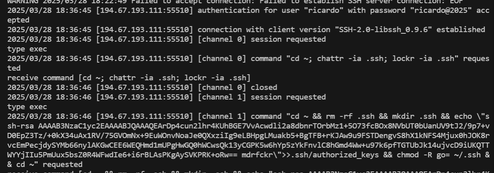

# SSH honeypot

An easy to set up and use SSH honeypot, a fake SSH server that lets anyone in and logs their activity

Modified from `sshesame`, accepts and logs SSH connections and activity (channels, requests), without doing anything on the host (e.g. executing commands, making network requests).



### systemd

```desktop
[Unit]
Description=SSH honeypot
After=network-online.target
Wants=network-online.target

[Service]
ExecStart=/path/to/sshesame #-config /path/to/sshesame.yaml
Restart=always

[Install]
WantedBy=multi-user.target
```

